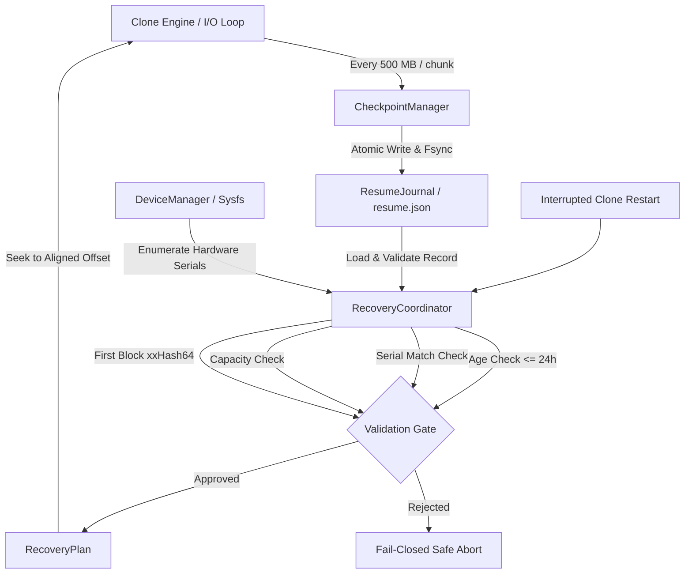

# Phase 7 Engineering Plan: Resume & Recovery Architecture

## 1. Executive Summary

Phase 7 introduces crash-resilient cloning and checkpoint recovery to DiskClone. In the event of an abrupt power loss, system crash, or user interruption during large multi-terabyte disk migrations, the application must safely resume from the last known-good chunk boundary without restarting from byte 0, while mathematically guaranteeing that:
1. The destination device has not been swapped or replaced.
2. The source device identity matches the original image.
3. Checkpoint data older than 24 hours is rejected to avoid stale sector drift.
4. Checkpoint journal writes are atomic and immune to filesystem-level corruption during crashes.

---

## 2. Core Components & Responsibilities

### 2.1 Resume Record Specification (`ResumeRecord`)
- **`source_serial`**: Serial number string of the source block device.
- **`dest_serial`**: Serial number string of the destination target disk.
- **`source_size_bytes`**: Exact byte size of the source drive.
- **`last_completed_offset`**: Highest verified byte offset successfully written to the target.
- **`chunk_size`**: Chunk block size in bytes (typically 4 MB).
- **`first_block_xxhash`**: xxHash64 digest of the first 4 MB block of the source disk.
- **`timestamp_epoch_secs`**: Unix epoch timestamp marking the last journal flush.

### 2.2 Atomic Persistence Pattern (`ResumeJournal`)
To prevent corruption caused by sudden system death mid-write:
1. Serialize `ResumeRecord` to pretty-printed JSON.
2. Write payload to sibling temporary file: `<journal_path>.tmp`.
3. Invoke `File::sync_all()` (`fsync(2)`) to flush dirty OS page cache pages to physical media.
4. Execute `std::fs::rename(2)` from `.tmp` to target path.
5. In POSIX filesystems, directory rename within the same mount is strictly atomic.

### 2.3 Recovery Coordinator (`RecoveryCoordinator`)
- Evaluates existing journals on startup.
- **24-Hour Checkpoint Expiry**: Calculates `now - record.timestamp_epoch_secs`. If `> 86,400s`, the checkpoint is marked expired and rejected (`ResumeError::CheckpointExpired`).
- **Hardware Serial Verification**: Matches `record.source_serial` and `record.dest_serial` against `sysfs`/`udev` properties. Any mismatch aborts with `ResumeError::SerialMismatch`.
- **Capacity & Alignment Check**: Re-verifies `dest_capacity >= source_size` and aligns starting offset to `chunk_size` multiples.
- **Initial Block Hash**: Reads initial 4 MB block and computes xxHash64 to verify underlying drive contents have not mutated out-of-band.
- **Journal Cleanup**: Upon 100% clone completion, atomically removes the journal and any orphan `.tmp` files.

---

## 3. Safety Invariants & Guarantees

| Invariant | Implementation Mechanism | Failure Mode Handling |
| :--- | :--- | :--- |
| **No Cross-Device Resume** | Serial number matching on both source and destination | Abort with `ResumeError::SerialMismatch` |
| **No Stale Resumes** | 24-hour maximum retention limit (`MAX_CHECKPOINT_AGE_SECS`) | Rejects resumption, prompts fresh clone |
| **No Mid-Chunk Corruption** | Floor chunk alignment: `(offset / chunk) * chunk` | Discards uncommitted partial chunk |
| **Zero Torn Writes** | Temp file write + `fsync` + atomic `rename` | If crash occurs during write, prior checkpoint remains intact |
| **Hardware Mutex Protection** | `O_DIRECT \| O_EXCL` block device access | Fails if another process acquired descriptor |

---

## 4. Verification & Testing Matrix

The unit test suite (`tests/unit/resume_recovery.rs`) establishes 18 automated tests:
1. `test_recovery_valid_checkpoint_plan_creation`
2. `test_recovery_device_serial_verification_success`
3. `test_recovery_fails_on_source_serial_mismatch`
4. `test_recovery_fails_on_dest_serial_mismatch`
5. `test_recovery_checkpoint_retention_valid_within_24h`
6. `test_recovery_checkpoint_retention_expired_after_24h`
7. `test_recovery_retention_boundary_exact_second`
8. `test_recovery_atomic_progress_update_and_persistence`
9. `test_recovery_corrupted_journal_fails_gracefully`
10. `test_recovery_missing_journal_fails_gracefully`
11. `test_recovery_source_size_mismatch_fails`
12. `test_recovery_dest_capacity_insufficient_fails`
13. `test_recovery_offset_exceeds_total_size_fails`
14. `test_recovery_first_block_xxhash_verification_success`
15. `test_recovery_first_block_xxhash_verification_failure`
16. `test_recovery_cleanup_journal_removes_checkpoint`
17. `test_recovery_chunk_alignment_and_rounding`
18. `test_recovery_percentage_and_chunks_calculation`
